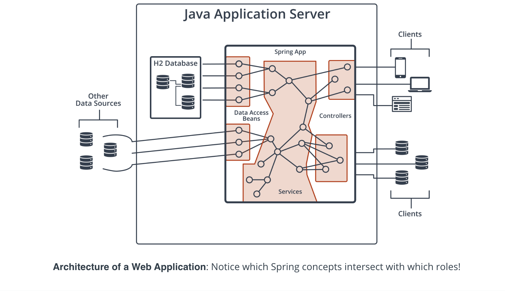

# 2. Spring Boot Basics 
___

## Lesson 1: Introduction to Spring Boot 

### 3. Introduction 

---

Web Development means building web applications, and in a standard web application, there are three main components:

* Data Storage
* Application Logic
* Client Access

By the end of the course, you're going to learn how to build and manage each of those components in Java using Spring Boot.

### Data Storage

Some of those beans will be responsible for interacting with the database. We will be using a SQL database called H2, which is an in-memory SQL database hosted by Spring Boot. You'll learn to use MyBatis, a Java library for database interaction, to generate data-access beans, which will be used by other services in your application logic to satisfy client requests.

### Application Logic

Application logic manages client access and database interaction. For this course, you're going to learn how to use Spring Boot to maintain a collection of beans, which are small components of application logic that can interact with each other to carry out complex tasks.

### Client Access

The client that will access our application is a web browser, which will send HTTP requests to our app and usually expects HTML in return. Using Spring MVC and Spring Security, libraries provided to us by Spring Boot, you will learn to create special beans called controllers that you can configure to respond to client requests and generate HTML responses. Controllers act as the entry points of your application, from a client's perspective.

