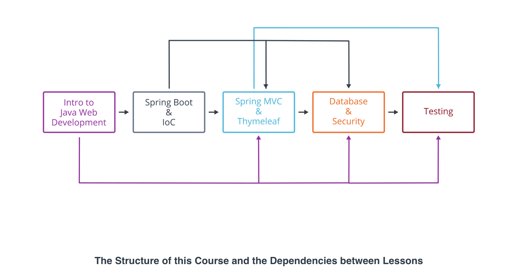

# 2. Spring Boot Basics 
___

## Lesson 1: Introduction to Spring Boot 

### 8. Course Outline 

___

* Basics of **Java server architecture**, dependency management in Java, and how Spring integrates with both.
* **Core Spring principles**. We'll be covering dependency injection, bean configuration, service development, and server-wide configuration.
* **Spring MVC and Thymeleaf**, an HTML template engine. We'll talk about Spring controllers, Thymeleaf template attributes, and connecting the two with the MVC pattern.
* **Connecting your Spring app to a database** and securing it with **Spring Security**. We'll cover the basics of ORM and MyBatis, an ORM tool for Java. We'll use the database to store user credentials securely and use them to authenticate users with Spring Security.
* **Testing and web browser automation with Selenium**. We'll cover how to set up and run tests with JUnit, how a web driver works, and how to simulate user actions in the browser with Selenium. We'll also discuss page objects, Selenium's powerful abstraction tool.